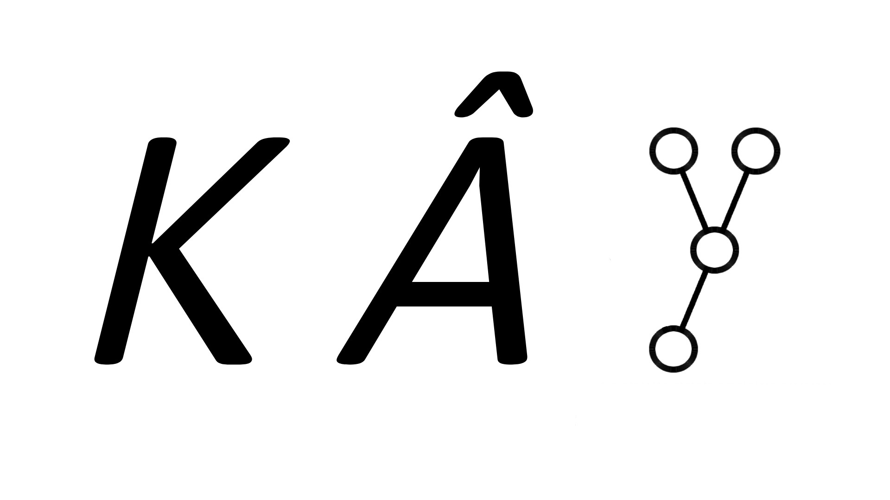

# KÂY 

KÂY (English: KAY, đọc là /kaɪ/ trong từ "kayak" hoặc /keɪ/ trong "okay") là một ứng dụng Python biểu diễn cây phân đoạn và các thuộc tính của nó.
<br>
<br>
Cây được vẽ bằng một phiên bản đã được chỉnh sửa của thuật toán Reingold-Tilford và được dùng để vẽ cây nhị phân đầy đủ

# Cài đặt

Yêu cầu:
- Python 3.10+
- Pygame Community Edition 2.1.4+
- pygame-gui 0.6.9+
- OpenCV 4.10.0.84+
- Numpy 2.1.1+

Đi đến [release page](https://github.com/bennett-nguyen/KAY/releases) và tải phiên bản mới nhất. Nếu không thì bạn có thể git clone repo này về hoặc nhấn vào nút Download as ZIP.

Tôi khuyên rằng nên tạo một môi trường ảo cho Python và kích hoạt nó trước khi cài đặt các dependencies và chạy phần mềm này. Để cài đặt dependencies, vào folder của project rồi tải chúng thông qua `pip`.

Linux:

```bash
$ cd KAY/                         # chuyển vào folder chứa phần mềm
$ python3 -m venv .venv                   # tạo môi trường ảo
$ source .venv/bin/activate               # kích hoạt môi trường
(.venv) $ pip install -r requirements.txt # tải dependencies
(.venv) $ python entry.py                 # để chạy phần mềm
```

Windows:

```ps
C:\...> cd KAY/                   # chuyển vào folder chứa phần mềm
C:\...\KAY> python -m venv .venv       #  tạo môi trường ảo
C:\...\KAY> .venv\Scripts\activate.bat # kích hoạt môi trường
(.venv) C:\...\KAY> pip install -r requirements.txt # tải dependencies
(.venv) C:\...\KAY> python3 entry.py   # để chạy phần mềm
```

Nếu bạn đã tạo một môi trường sẵn rồi thì chỉ cần kích hoạt và chạy phần mềm thôi.

# Giấy phép

Phần mềm này được cấp phép dưới [GNU General Public License phiên bản 3](./LICENSE).
```
Copyright (C) 2023 Nguyễn Vĩnh Phú

Đây là phần mềm tự do: bạn được quyền tái bản nó và/hoặc chỉnh sửa
nó dưới điều khoản của Giấy Phép GNU General Public License được
xuất bản bởi Free Software Foundation, có thể là ở phiên bản 3 của
giấy phép, hoặc (tùy lựa chọn của bạn) ở các phiên bản sau.

Phần mềm này được xuất bản với một niềm hy vọng rằng nó sẽ trở nên
hữu ích nhưng sẽ KHÔNG CÓ SỰ BẢO ĐẢM; kể cả sự bảo đảm được ngụ ý
về việc THƯƠNG MẠI HÓA PHẦN MỀM NÀY hoặc PHÙ HỢP CHO MỘT MỤC ĐÍCH
CỤ THỂ. Hãy đọc Giấy Phép GNU General Public License để biết thêm
thông tin.

Bạn có thể đã nhận được Giấy Phép GNU General Public License
được đính kèm với phần mềm này. Nếu không, xem <https://www.gnu.org/licenses/>.

Email: bennett-contact-me-github.magnify754@simplelogin.com
```
