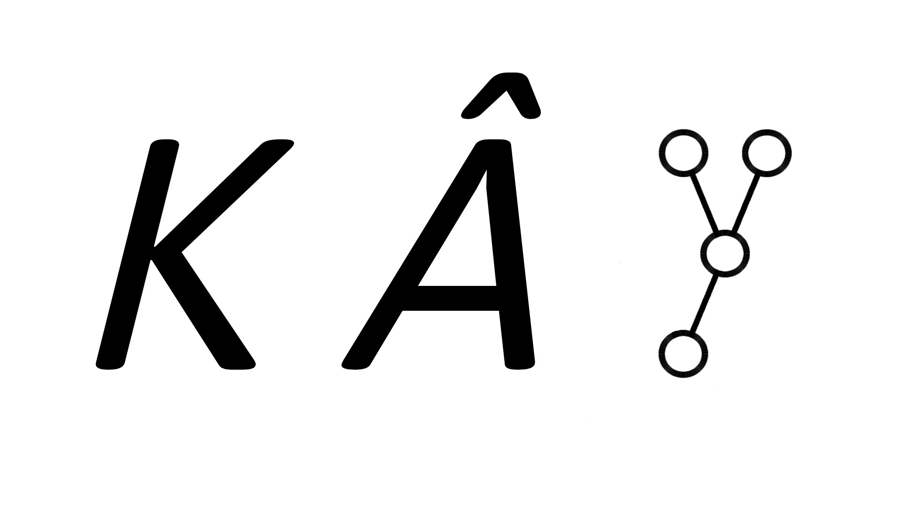

# KÂY
KÂY (English: KAY, read either as kaɪ in "kayak" or keɪ in "okay") is a Python application that visualizes the segment tree as well as its properties.
<br>
<br>
The tree is drawn using the modification version of the Reingold-Tilford algorithm for drawing perfect binary trees.

# Installation
Requirements:
- Python 3.10+
- Pygame Community Edition 2.1.4+
- pygame_gui 0.6.9+

Clone this repository or download the code as `ZIP`, run the `entry.py` in the project directory.
# License
This application is licensed under the [GNU General Public License version 3](./LICENSE).
```
Copyright (C) 2023 Nguyen Vinh Phu

This program is free software: you can redistribute it and/or modify
it under the terms of the GNU General Public License as published by
the Free Software Foundation, either version 3 of the License, or
(at your option) any later version.

This program is distributed in the hope that it will be useful,
but WITHOUT ANY WARRANTY; without even the implied warranty of
MERCHANTABILITY or FITNESS FOR A PARTICULAR PURPOSE.  See the
GNU General Public License for more details.

You should have received a copy of the GNU General Public License
along with this program. If not, see <https://www.gnu.org/licenses/>.

Email: bennett-contact-me-github.magnify754@simplelogin.com
```
